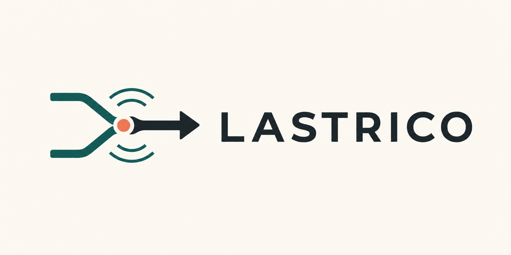
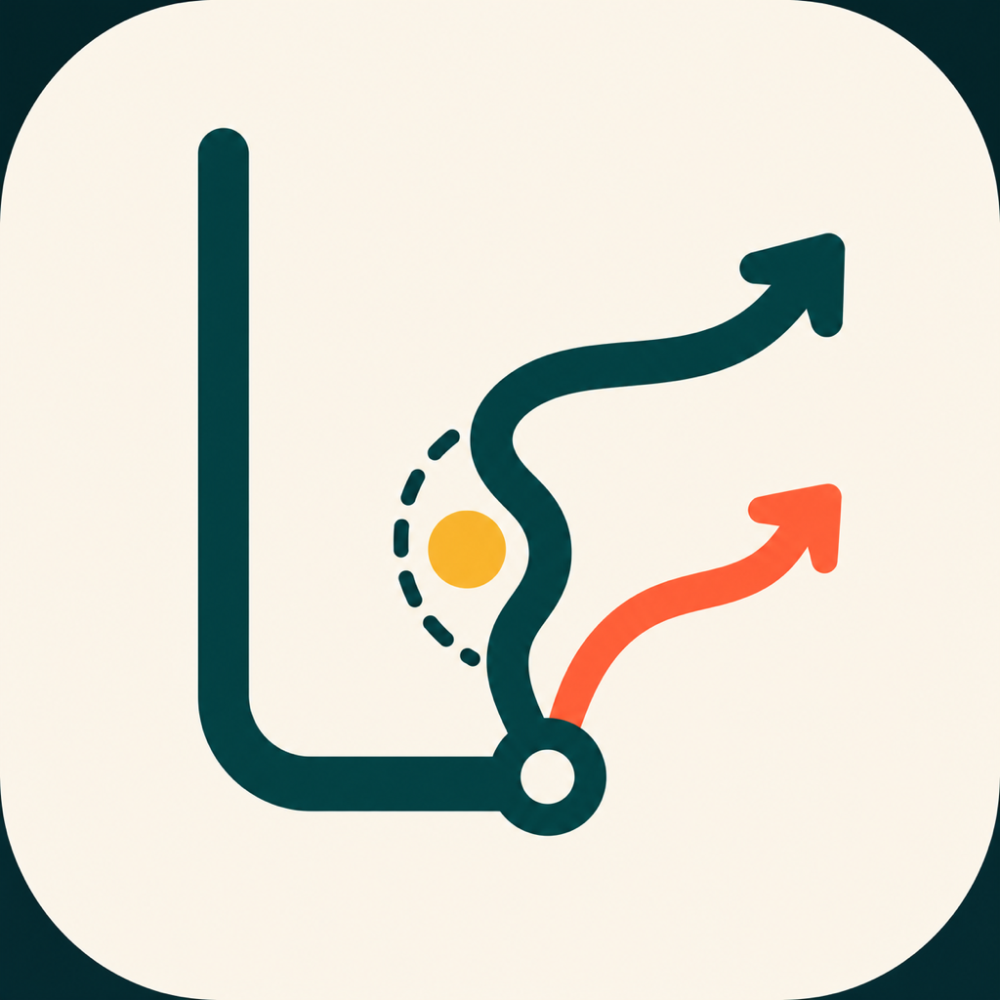

# Lastrico brand concept

## Brand idea

**Lastrico — road intelligence for routes that fit the journey.**

Lastrico is not tied to Milan, one transport mode, or one type of surface. The identity
represents a route reaching a decision point, recognising a road condition, and presenting
an informed alternative.

The concept is a first design direction, not a registered trademark or a final production
brand system.

## Primary concept

The horizontal lockup combines:

- two possible paths;
- a highlighted decision or road-condition point;
- a clear onward direction;
- the `LASTRICO` wordmark.

## App-icon concept

The icon uses an abstract `L`, a route choice, and a condition marker. It deliberately avoids
cars, bicycles, Milan landmarks, map pins, shields, checkmarks, and accident imagery.

## Palette

| Role | Colour |
| --- | --- |
| Primary route | Deep petrol `#073B3A` |
| Alternative | Signal coral `#FF6B4A` |
| Condition marker | Amber `#F4B942` |
| Background | Warm ivory `#F7F2E8` |
| Text | Slate `#162527` |

## Production work still required

- redraw and refine the selected mark as an original vector master;
- run trademark and visual-similarity checks;
- create light, dark, monochrome, small-size, and accessibility variants;
- export Apple and Android production icon sets with correct safe areas;
- validate contrast and legibility at 16, 24, 32, 48, and 64 px;
- define typography, spacing, motion, tone of voice, and usage rules.

The generated PNG concepts are references for review. They should not be treated as final
vector artwork.
